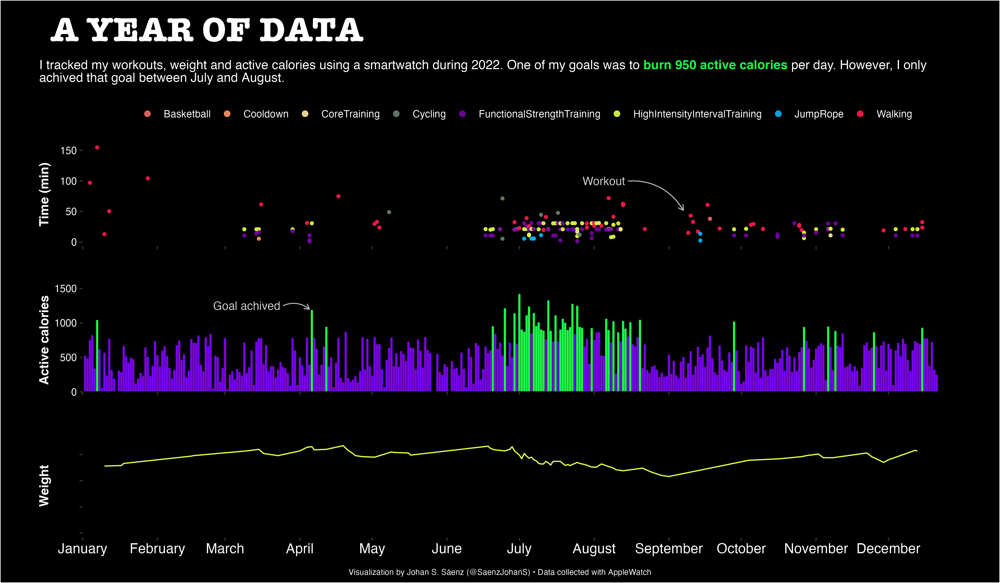
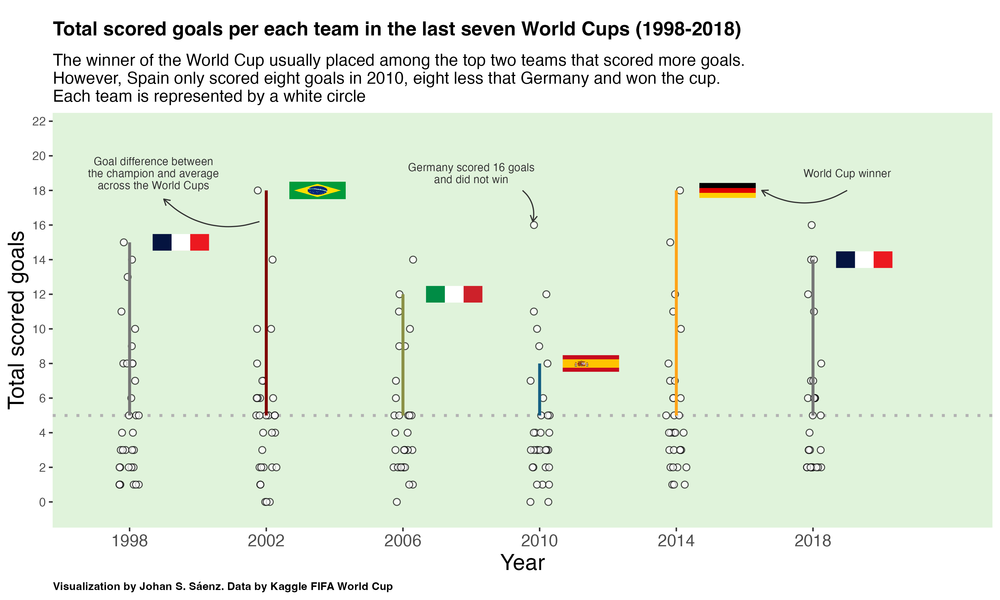
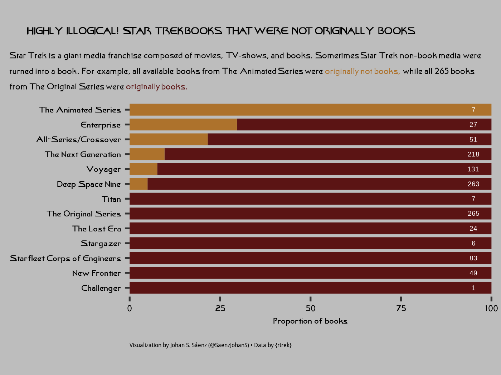

Here you can find some of the data visualization created by me, mainly using the
data from the [#TidyTuesday challenge](https://github.com/rfordatascience/tidytuesday)

# Personal projects

I want to analyse how active I am. I will collect daily data and update the plot at
the beginning of every month.

This plot is the summary of my 2022

# TidyTuesday

## 2022

## 2023

# Tutorials