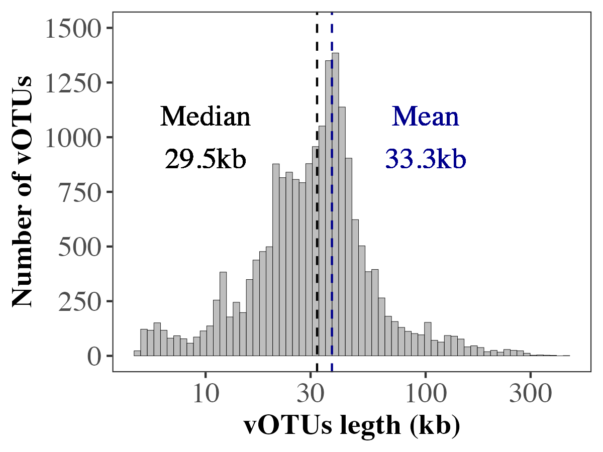
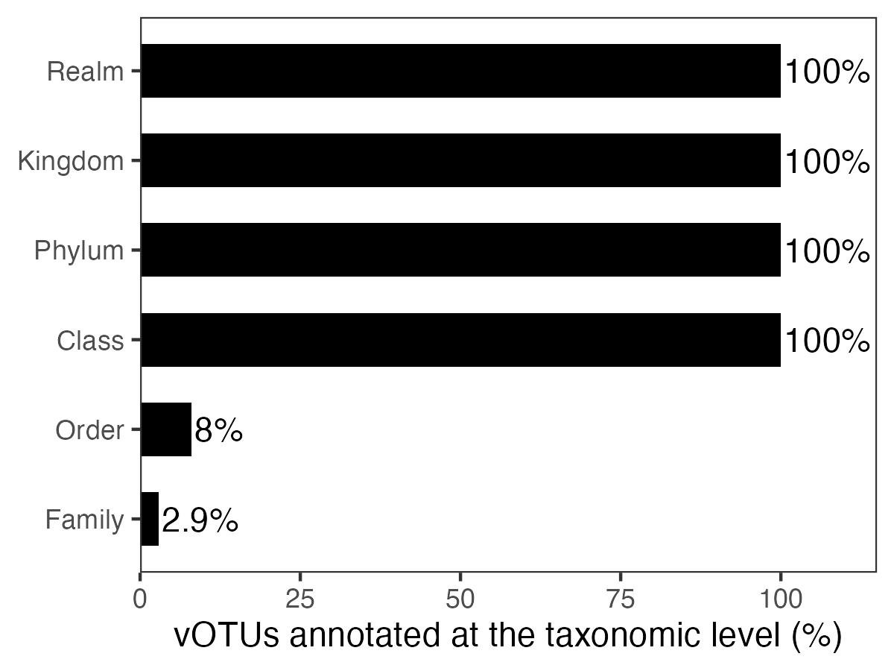
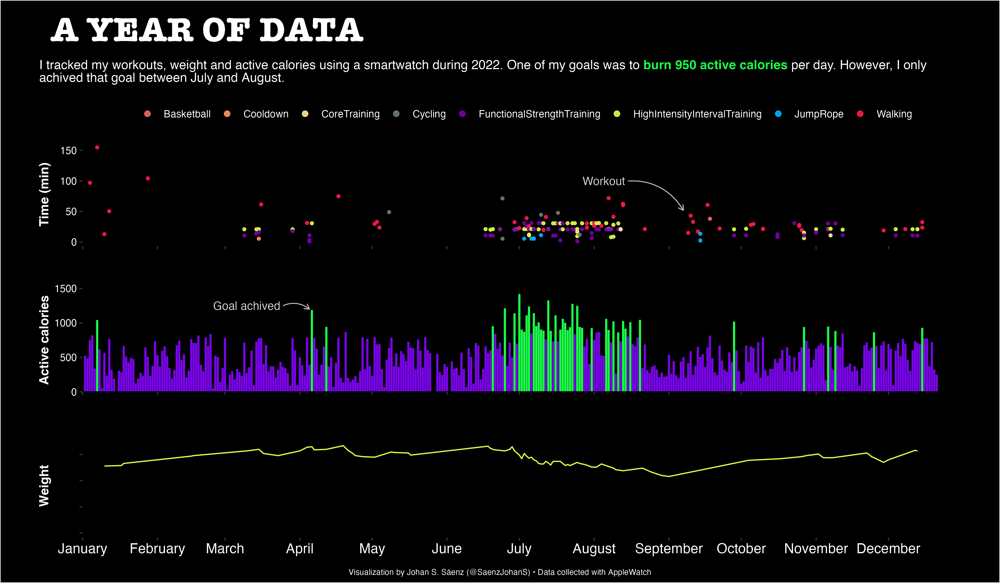
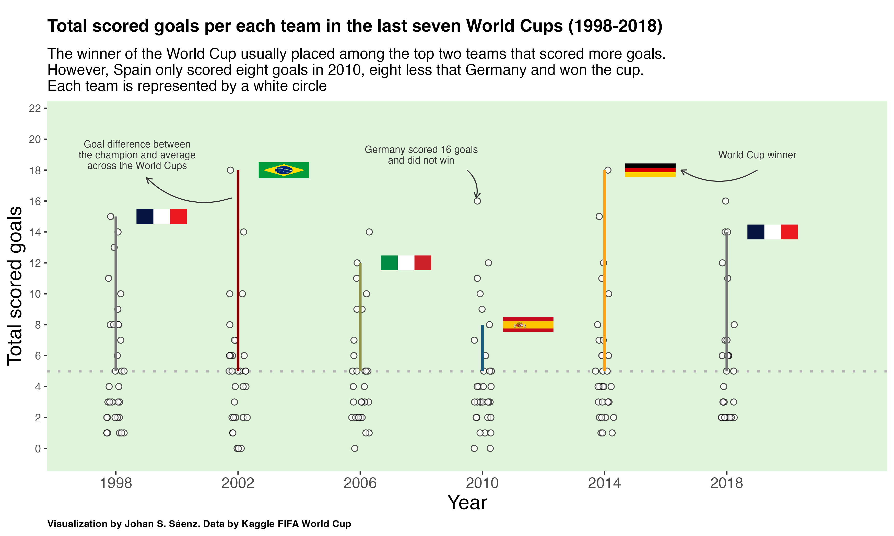
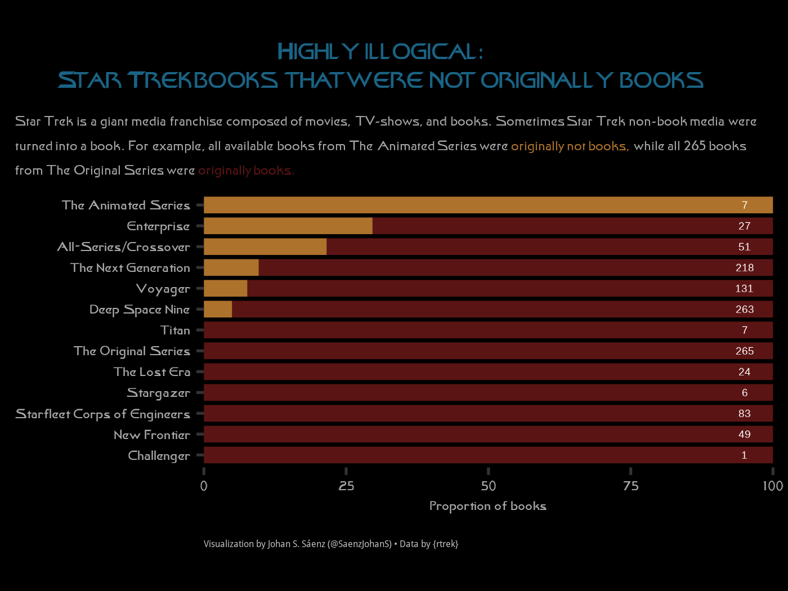

# Academic projects

## Collection of viral genomes from the chicken gut

At the University of Hohenheim, we have recently reconstructed approximately 20,000 viral genomes from chicken gut metagenomic samples. This collection includes several large viral genomes and reveals a remarkable level of novelty, with more than 97% of the sequences likely representing previously uncharacterised viral diversity, potentially forming new viral families. This dataset provides a valuable resource for expanding global viral genome collections and offers opportunities for comparative analyses across different environments, enabling deeper insights into viral diversity, evolution, and ecological distribution.

This collection of genomes can be download from [Zenodo](https://zenodo.org/records/15063554)

::: {style="display: flex; gap: 10px;"}
 
:::

## The Vault

Everyday bioinformatic tools are release and it is quite difficult to keep track of them.
I have created a searchable repository of bioinformatic books and tools group in 
five categories: books, metagenomics, genomics, amplicons, metaproteomics and R.
This has been of great use for stablishing my workflows and I hope other people can use it.

The repository is available here: [The Vault](https://sebassaenz.github.io/thevault/)

# Personal projects

I want to analyse how active I am. I will collect daily data and update the plot at the beginning of every month.

This plot is the summary of my 2022

# TidyTuesday

## 2022

## 2023

# Tutorials
