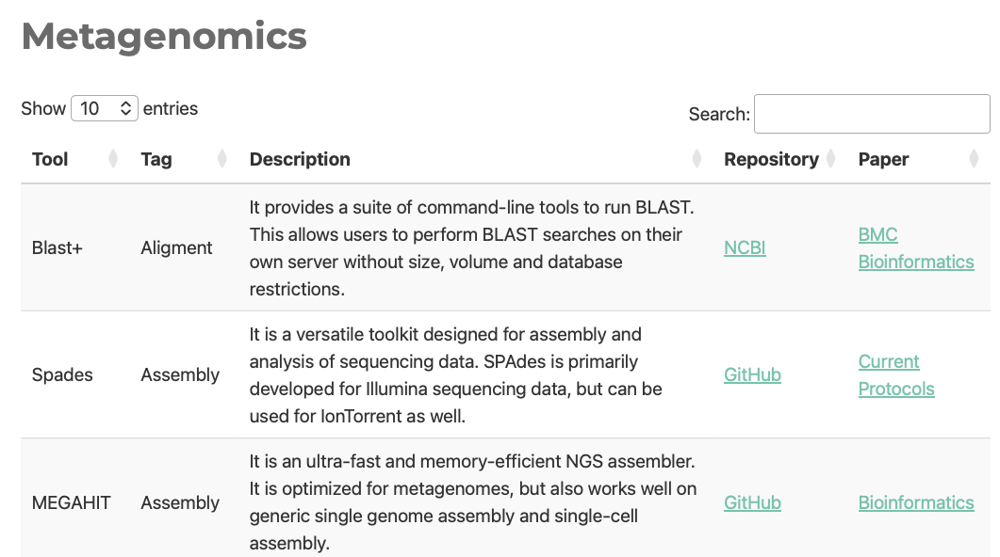
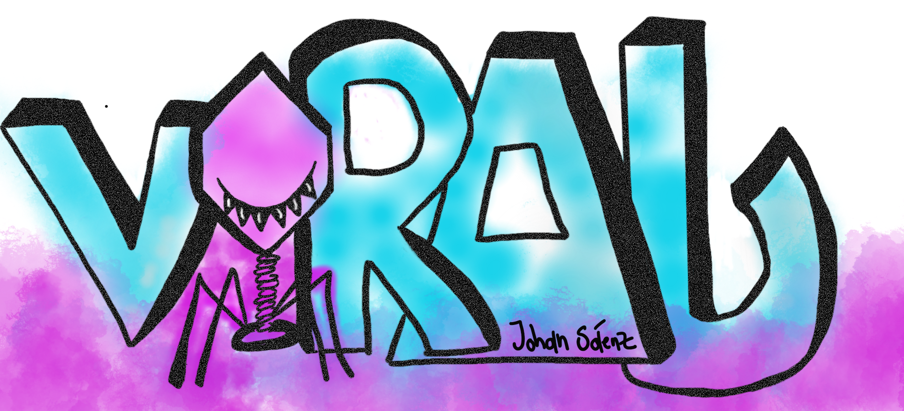

# Academic projects

## Collection of viral genomes from the chicken gut

At the University of Hohenheim, we have recently reconstructed approximately 20,000 viral genomes from chicken gut metagenomic samples. This collection includes several large viral genomes and reveals a remarkable level of novelty, with more than 97% of the sequences likely representing previously uncharacterised viral diversity, potentially forming new viral families. This dataset provides a valuable resource for expanding global viral genome collections and offers opportunities for comparative analyses across different environments, enabling deeper insights into viral diversity, evolution, and ecological distribution.

This collection of genomes can be download from [Zenodo](https://zenodo.org/records/15063554)

::: {style="display: flex; gap: 10px;"}
 
:::

## The Vault

New bioinformatics tools are released on a daily basis, making it difficult to keep track of relevant resources. To address this, I developed a searchable repository that curates bioinformatic books and tools across key areas, including metagenomics, genomics, amplicon analysis, metaproteomics, and R. This resource has been valuable in structuring and refining my own data analysis workflows, and it is intended to support other bioinformatic enthusiast.

The repository is available here: [The Vault](https://sebassaenz.github.io/thevault/)

## Viral Collections in GenBank

Phages are the most abundant and diverse biological entities on the planet. However, our knowledge of them is quite limited. There are currently thousands of phage genomes in the NCBI and this number will continue to grow as researchers produce sequencing data. This website provides an overview of the number of phages and jumbo phages, size, molecule type and host of bacteriophage genomes stored in the NCBI.

GenBank viral online resource: [Website](https://sebassaenz.github.io/genbank_viral/)

## MicroTutorials

I initially found learning R challenging. As I developed my skills, I realised that consistent practice is essential for building confidence. Because of that, I created a short tutorials that use sequencing and metaproteomics data to introduce key concepts in R and data visualisation. These tutorials are designed to provide practical, hands-on experience and to support others in developing their own analytical skills.

Introduction to R using metaproteomics: [Tutorial](https://sebassaenz.github.io/MicroTutorials/)

Data wrangling with amplicon sequencing data [Tutorial](https://github.com/SebasSaenz/coding_club/blob/main/data_wrangling.md)

# Personal projects

## A year of data

I wear an Apple Watch almost every day and use the collected data to summarise my activity patterns over time. To explore these data, I developed a workflow in an R Markdown file that generates visualisations of my activity levels across the year. This approach provides a simple way to track trends and reflect on personal activity patterns, and the workflow can be adapted to create similar summaries using your own data.

Do you want to explore your data? Have a look at my: [Workout repository](https://github.com/SebasSaenz/workouts)

This plot is my 2025 summary

