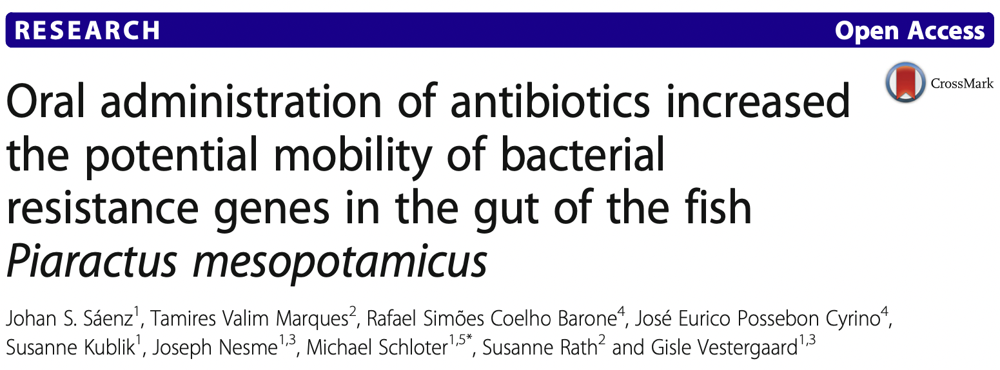

Here you can find some selected publications but if you are interested in the full
list, you can browse around in <a href="https://scholar.google.com/citations?user=T1Nf7hQAAAAJ&hl=en" target="_blank">Google Scholar</a>

* Hwang, Y., Schulze-Makuch, D., Arens, F. L., **Saenz, J. S.**, Adam, P. S., Sager, C., ... & Probst, A. J. (2021). **Leave no stone unturned: individually adapted xerotolerant Thaumarchaeota sheltered below the boulders of the Atacama Desert hyperarid core**. Microbiome, 9(1), 1-17.

* Tröscher-Mußotter, J., **Saenz, J. S.**, Grindler, S., Meyer, J., Kononov, S. U., Mezger, B., ... & Seifert, J. (2021). **Microbiome Clusters Disclose Physiologic Variances in Dairy Cows Challenged by Calving and Lipopolysaccharides**. Msystems, 6(5), e00856-21.

* **Sáenz, J. S.**, Marques, T. V., Barone, R. S. C., Cyrino, J. E. P., Kublik, S., Nesme, J., ... & Vestergaard, G. (2019). **Oral administration of antibiotics increased the potential mobility of bacterial resistance genes in the gut of the fish Piaractus mesopotamicus**. Microbiome, 7(1), 1-14.

* **Sáenz, J. S.**1, Roldan, F., Junca, H., & Arbeli, Z. (2019). **Effect of the extraction and purification of soil DNA and pooling of PCR amplification products on the description of bacterial and archaeal communities**. Journal of Applied Microbiology, 126(5), 1454-1467.

* Schulze-Makuch, D., Wagner, D., Kounaves, S. P., Mangelsdorf, K., Devine, K. G., de Vera, J. P., **Saenz, J. S.**, ... & Zamorano, P. (2018). **Transitory microbial habitat in the hyperarid Atacama Desert**. Proceedings of the National Academy of Sciences, 115(11), 2670-2675.