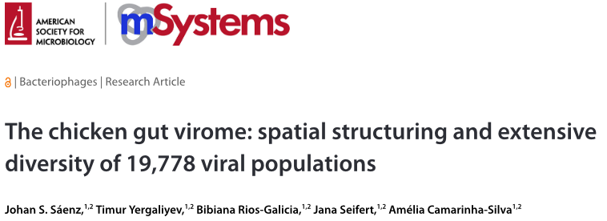

Here you can find some relevant publications but if you are interested in checking further, you can browse around in <a href="https://scholar.google.com/citations?user=T1Nf7hQAAAAJ&hl=en" target="_blank">Google Scholar</a>

-   **Sáenz, J. S.**, Yergaliyev, T., Rios-Galicia, B., Seifert, J., & Camarinha-Silva, A. (2026). The chicken gut virome: spatial structuring and extensive diversity of 19,778 viral populations. <a href="https://journals.asm.org/doi/full/10.1128/msystems.00191-26" target="_blank">Msystems</a>, e00191-26.

-   **Sáenz, J. S.**, Rios-Galicia, B., & Seifert, J. (2025). Antiviral defense systems in the rumen microbiome. <a href="https://journals.asm.org/doi/full/10.1128/msystems.01521-24" target="_blank">mSystems</a>, 10 (2), e01521-24.

- Eichinger, J., Seifert, J., **Sáenz, J. S.**, Amin, N., Lorenz, S., Eckel, F., ... & Brugger,  D. (2025). The interaction of microplastics with the ruminal ecosystem in vitro. <a href="https://www.sciencedirect.com/science/article/pii/S0304389425034016" target="_blank">Journal of Hazardous Materials</a>, 140481.

-   Rios-Galicia, B., **Sáenz, J. S.**, Yergaliyev, T., Roth, C., Camarinha-Silva, A., & Seifert, J. (2024). Novel taxonomic and functional diversity of eight bacteria from the upper digestive tract of chicken. <a href="https://www.microbiologyresearch.org/content/journal/ijsem/10.1099/ijsem.0.006210" target="_blank">International Journal of Systematic and Evolutionary Microbiology</a>, 74(1), 006210.

-   **Sáenz, J. S.**, Rios-Galicia, B., Rehkugler, B., & Seifert, J. (2023). Dynamic development of viral and bacterial diversity during grass silage preservation. <a href="https://www.mdpi.com/1999-4915/15/4/951" target="_blank">Viruses</a>, 15(4), 951.

-   Tröscher-Mußotter, J., **Saenz, J. S.**, Grindler, S., Meyer, J., Kononov, S. U., Mezger, B., ... & Seifert, J. (2021). Microbiome Clusters Disclose Physiologic Variances in Dairy Cows Challenged by Calving and Lipopolysaccharides. <a href="https://journals.asm.org/doi/full/10.1128/msystems.00856-21">Msystems</a>, 6(5), e00856-21.

-   **Sáenz, J. S.**, Marques, T. V., Barone, R. S. C., Cyrino, J. E. P., Kublik, S., Nesme, J., ... & Vestergaard, G. (2019). Oral administration of antibiotics increased the potential mobility of bacterial resistance genes in the gut of the fish *Piaractus mesopotamicus*. <a href="https://link.springer.com/article/10.1186/s40168-019-0632-7">Microbiome</a>, 7(1), 1-14.

-   **Sáenz, J. S.**, Roldan, F., Junca, H., & Arbeli, Z. (2019). Effect of the extraction and purification of soil DNA and pooling of PCR amplification products on the description of bacterial and archaeal communities. <a href="https://academic.oup.com/jambio/article-abstract/126/5/1454/6715201">Journal of Applied Microbiology</a>, 126(5), 1454-1467.

-   Schulze-Makuch, D., Wagner, D., Kounaves, S. P., Mangelsdorf, K., Devine, K. G., de Vera, J. P., **Saenz, J. S.**, ... & Zamorano, P. (2018). Transitory microbial habitat in the hyperarid Atacama Desert. <a href="https://www.pnas.org/doi/abs/10.1073/pnas.1714341115">Proceedings of the National Academy of Sciences</a>, 115(11), 2670-2675.
