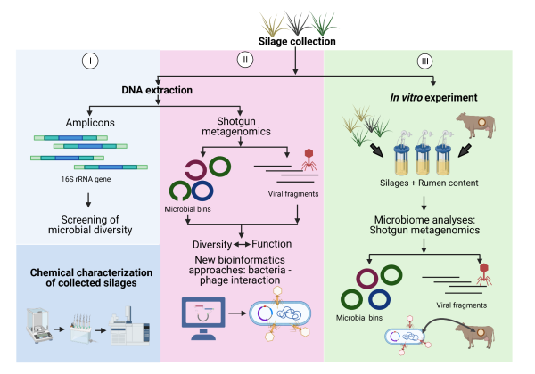
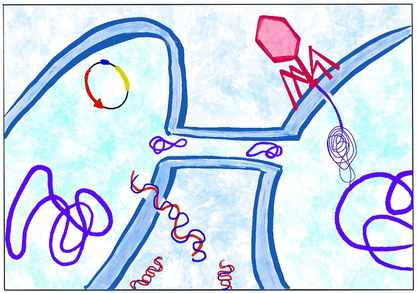

My research focuses on understanding how microbial communities adapt to environmental stress, with a particular emphasis on the role of mobile genetic elements (MGEs), viruses, and host–microbe interactions across diverse ecosystems.

I use integrative meta-omics approaches—primarily metagenomics and metaproteomics—to investigate microbial community structure, function, and evolution in both natural and host-associated environments.

  

### Viral ecology and microbiome interactions

A growing part of my research explores the role of viruses, particularly bacteriophages, in shaping microbial ecosystems. I have investigated viral–host dynamics in environments such as silage fermentation and animal microbiomes, showing that viral communities follow and influence bacterial succession.

In the rumen microbiome, I characterised the diversity of antiviral defence systems, revealing a highly diverse and unevenly distributed “pan-immune” repertoire across microbial genomes. In the chicken gut, I contributed to the reconstruction of nearly 20,000 viral populations, uncovering strong spatial structuring of the virome along the gastrointestinal tract and highlighting the vast, previously unexplored viral diversity in this system.

### Microbial adaptation and mobile genetic elements

A central theme of my work is the role of mobile genetic elements in shaping microbial adaptation. In extreme environments such as the Atacama Desert, I have shown that MGEs are enriched and closely associated with genes involved in core cellular processes such as replication, transcription, and energy metabolism, suggesting a role in long-term adaptation rather than transient stress response.

In contrast, in host-associated systems, such as the gut microbiome of fish exposed to antibiotics, MGEs contribute to the rapid spread of antibiotic resistance genes, highlighting their importance in short-term adaptive responses under strong selective pressure.

Together, these studies demonstrate that the function and dynamics of MGEs depend strongly on the type and timescale of environmental stress.

  

### Host-associated microbiomes and health

I have investigated microbial communities in a range of animal systems, including fish, livestock, and poultry. My work has shown how environmental perturbations—such as antibiotics, toxins, or physiological stress—reshape microbiome composition and function. For example, metaproteomic analyses revealed that dietary mycotoxins significantly alter gut microbial activity in piglets , while long-term studies in dairy cows identified distinct microbiome configurations linked to host physiology and health outcomes . More recently, I have contributed to studies demonstrating how microbiome-derived metabolites can serve as biomarkers for disease, improving diagnostic strategies in clinical contexts.

### Microbial ecology in extreme environments

My work in the Atacama Desert contributes to understanding life under extreme conditions. I have participated in studies identifying metabolically active microbial communities in hyperarid soils and characterising niche-specific adaptations, including highly specialised archaeal lineages adapted to extreme desiccation and radiation . These systems provide a natural laboratory for studying the limits of life and the mechanisms that enable microbial persistence under long-term environmental stress.

### Methodological contributions

In addition to ecological insights, I contribute to the development and evaluation of methodological frameworks in microbiome research. This includes work on metaproteomics standardisation and sample processing, demonstrating how methodological choices influence the interpretation of microbial community structure and function I also work on genome-resolved approaches to characterise microbial diversity, including the description of novel taxa and host-adapted bacterial lineages.
